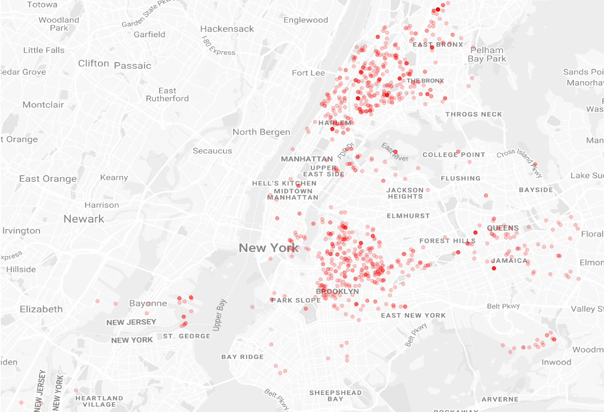

# Project: New York shooting incidents data

This repository contains functions written in python to analyse New York shooting incedent data and plot results.

## Getting Started

These instructions will help you to run the script on your maschine. First of all you need `python3` installed, as well as following packages (see: `requirements.txt`):

~~~
pandas==0.23.4
matplotlib==2.1.1
numpy==1.13.3
~~~

### Installing

Before running the script clone the repository to your desired directory:

~~~
cd /path/to/desired/directory
git clone git@github.com:Schlagoo/nypd_crime_data_analytics.git
~~~

After uncommenting the desired function, you can run the script from the terminal (linux) via:

(Make shure you the file is executable: `sudo chmod +x .code/main.py`!)  

~~~
python3 ./code/main.py
~~~

## Built with

* [Python 3.6.8](https://www.python.org/) - Programming language
* [Pandas](https://pandas.pydata.org/) - Python Data Analysis Library

## Author

* **Pascal Schlaak** - *Student* - [Schlagoo](https://github.com/Schlagoo)

